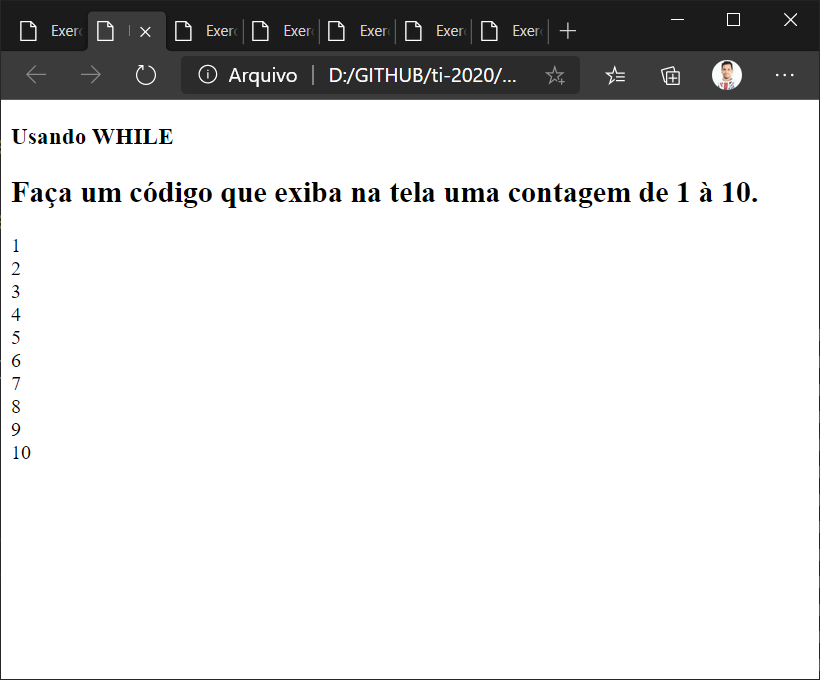
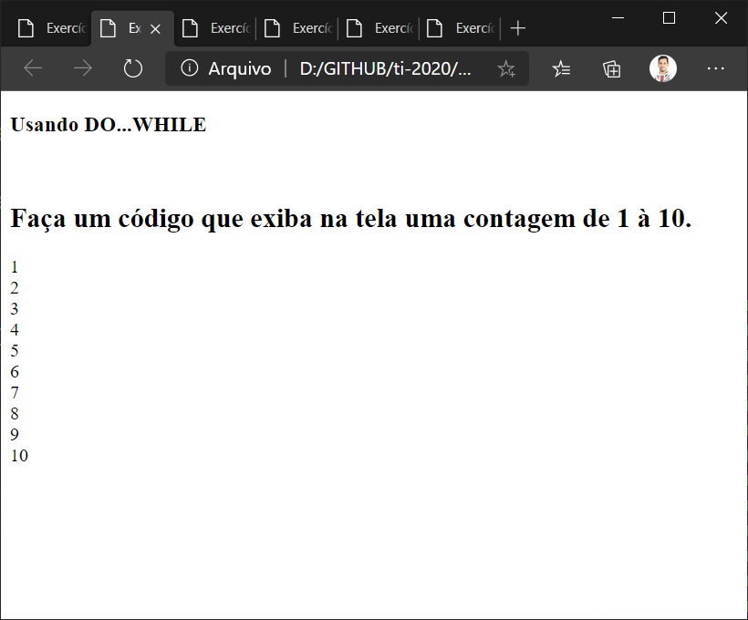

# Atividades
## 1. (FOR) Faça um código que exiba na tela uma contagem de 1 à 10.

**EX-001.html**

**EX-001.js**

______

## 2. (WHILE) Faça um código que exiba na tela uma contagem de 1 à 10.

**EX-002.html**

**EX-002.js**

______

## 3. (DO...WHILE) Faça um código que exiba na tela uma contagem de 1 à 10.

**EX-003.html**

**EX-003.js**

______

## 4. Faça um programa que imprima na tela os números de 1 a 20, um abaixo do outro. Depois modifique o programa para que ele mostre os números um ao lado do outro.

**EX-004.html**

**EX-004.js**

