***IMPORTANTE***: Todas os itens necessários para as atividades estão disponíveis na pasta ``nome-do-projeto`` dentro desse repositório. 

## Player

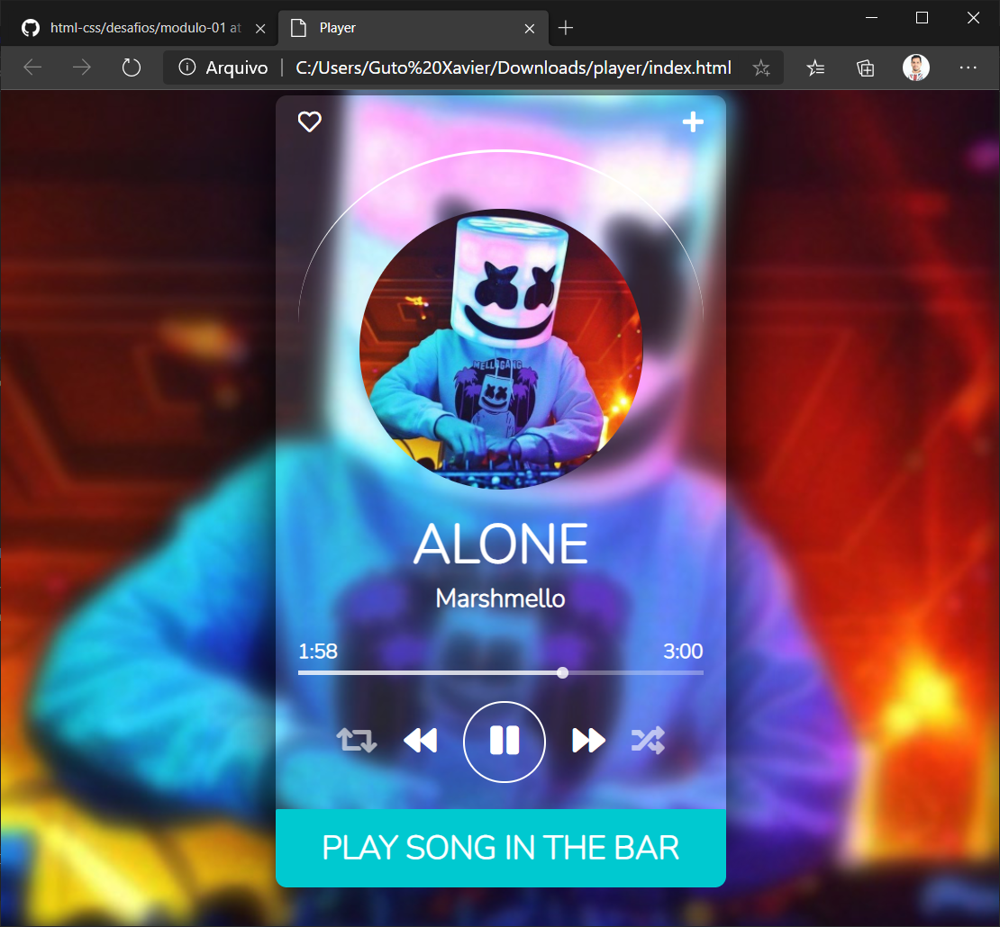

### index.html
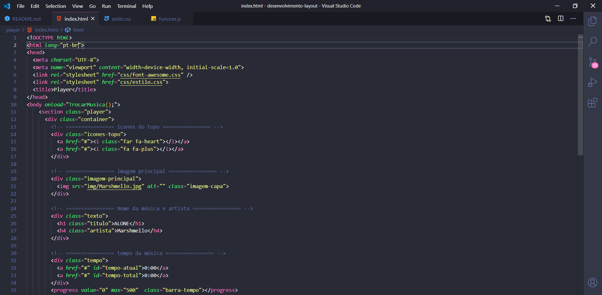
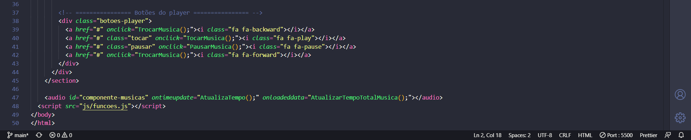

### estilo.css
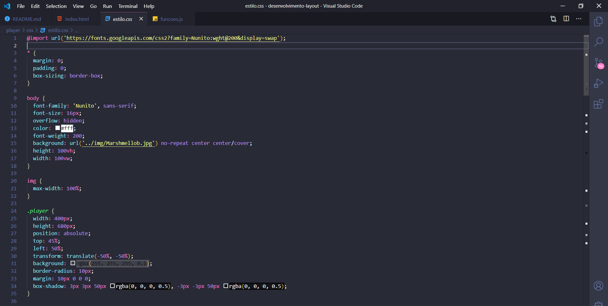
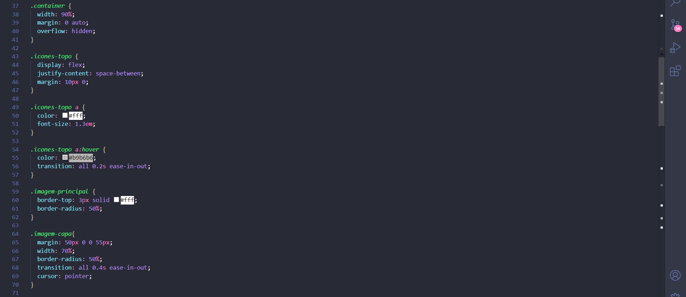
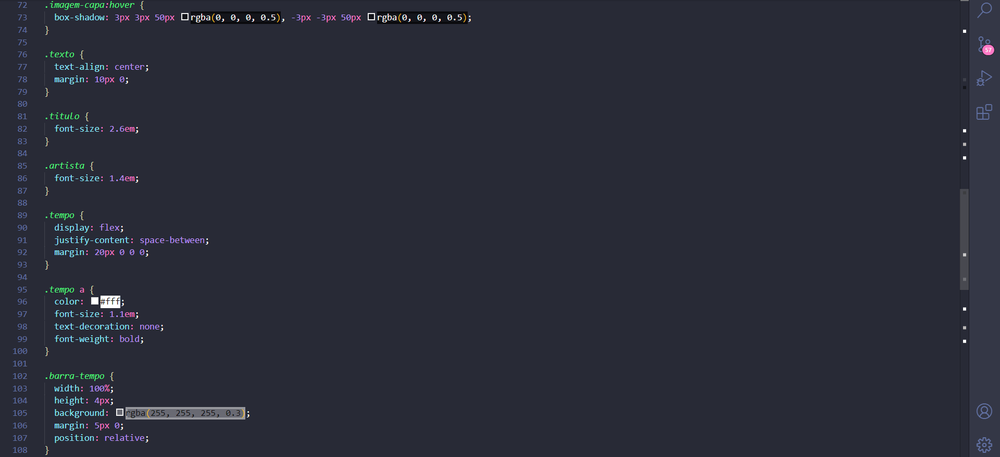
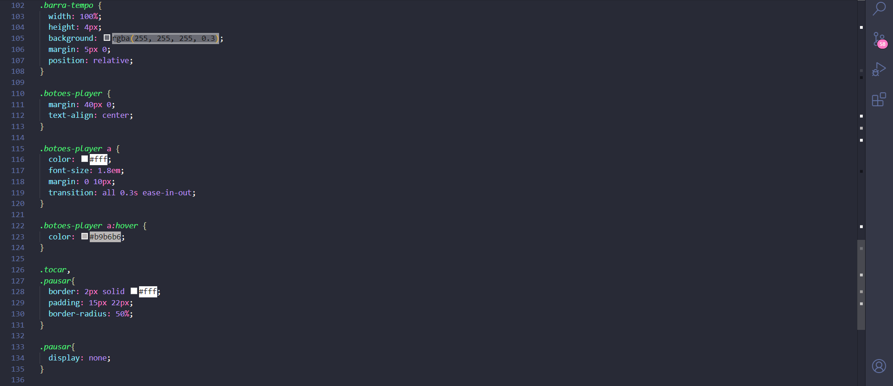

### funcoes.js
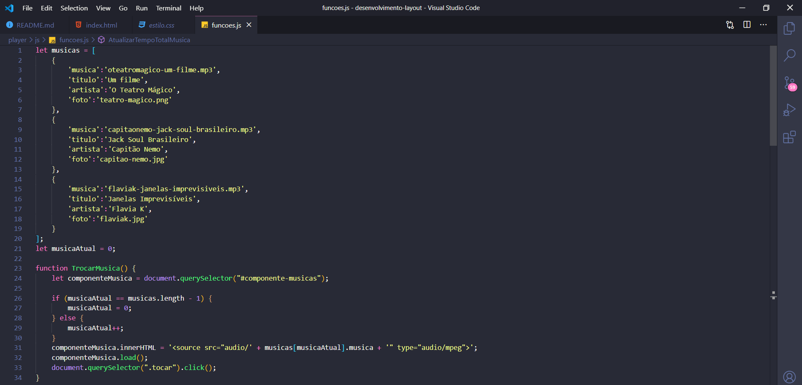
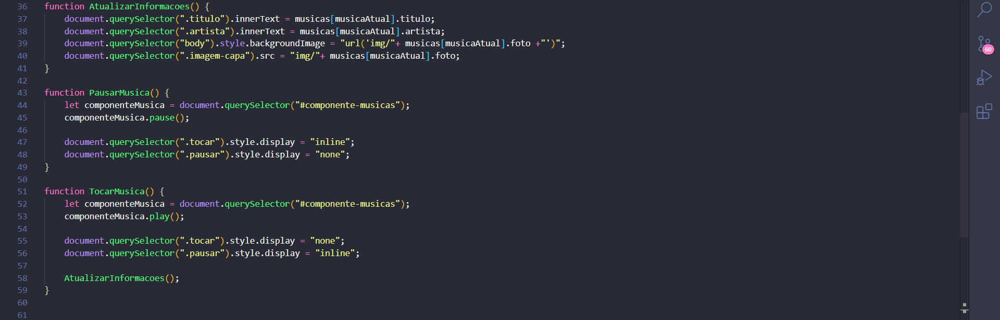
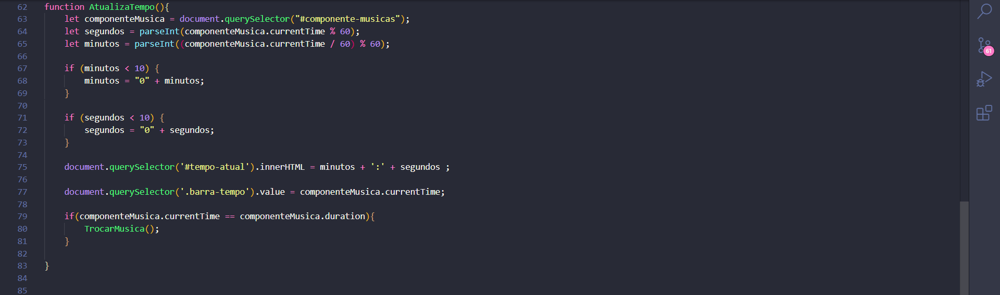
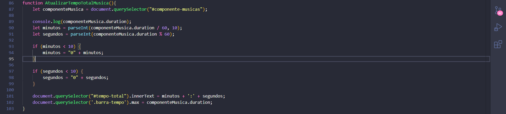 

_____

## Página de Login

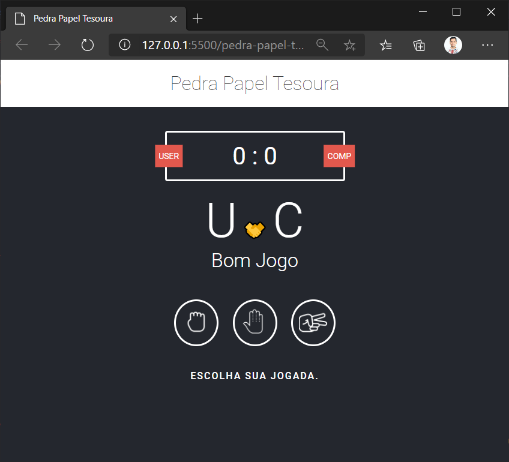

_____

## App

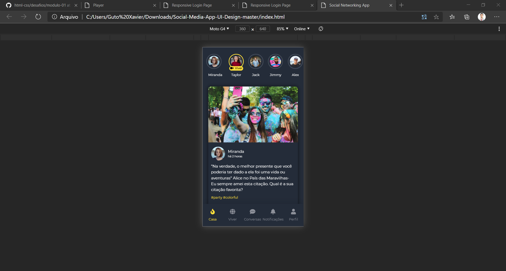

_____

## Modelo de site

____

## Modelo de site

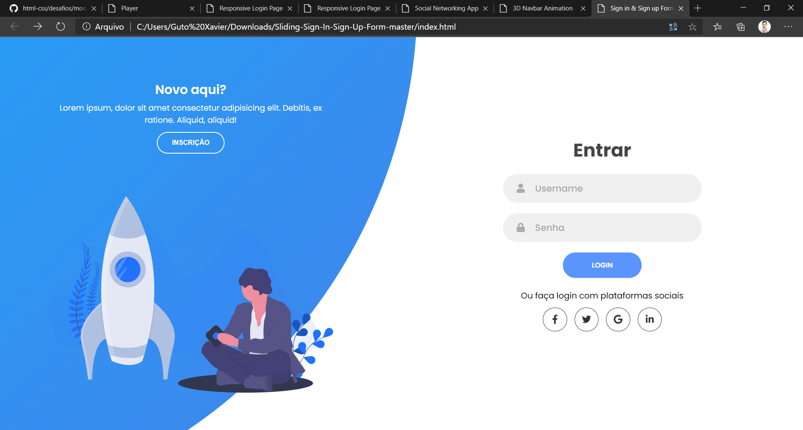

____

## Modelo de site

____

## Modelo de site

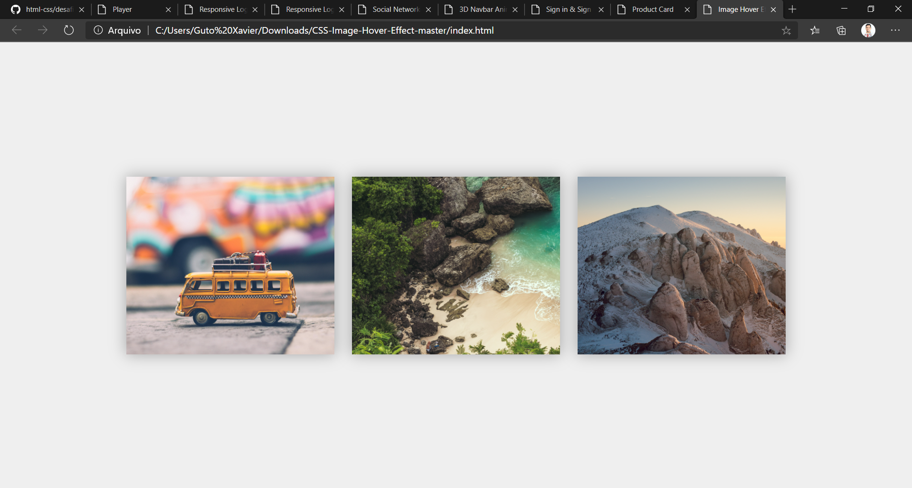

____

## Modelo de site

