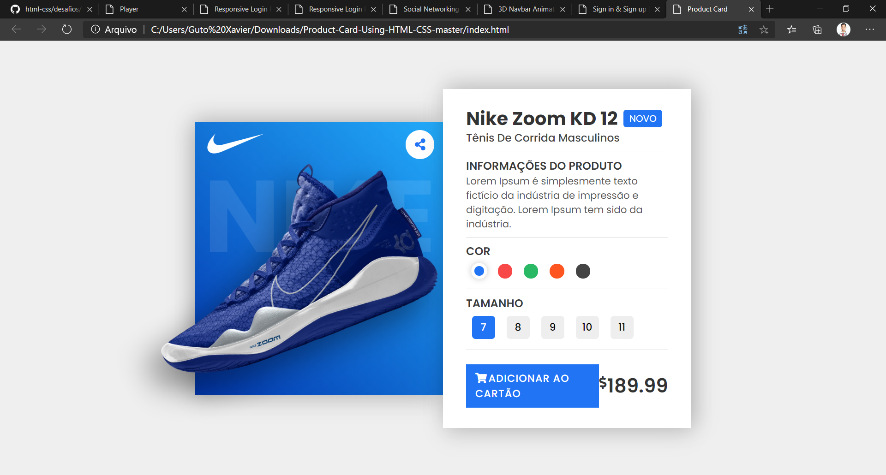

***IMPORTANTE***: Todas as imagens necessárias para as atividades estão disponíveis na pasta ``img-nome-do-projeto`` dentro desse repositório. 

## Player

_____

## Página de Login

_____

## App

_____

## Modelo de site

____

## Modelo de site

____

## Modelo de site

____

## Modelo de site

____

## Modelo de site

