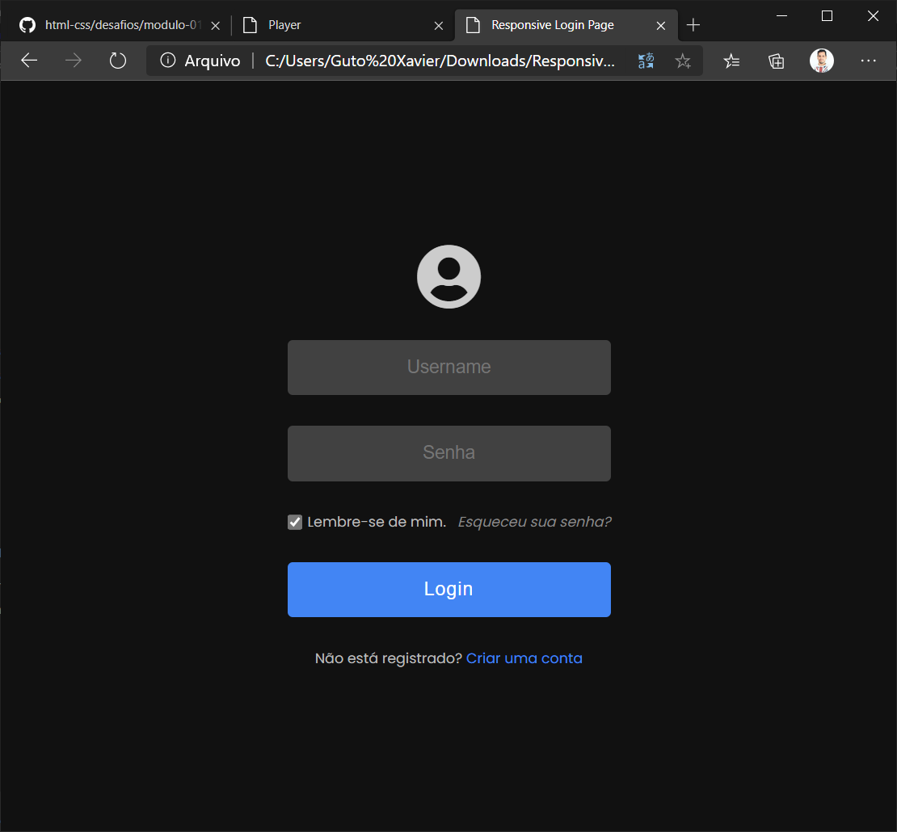

***IMPORTANTE***: Todas os itens necessários para as atividades estão disponíveis na pasta ``nome-do-projeto`` dentro desse repositório. 

## Player

### index.html

### estilo.css

### funcoes.js

 

_____

## Página de Login

_____

## App

_____

## Modelo de site

____

## Modelo de site

____

## Modelo de site

____

## Modelo de site

____

## Modelo de site

