***IMPORTANTE***: Todas as imagens necessárias para as atividades estão disponíveis na pasta ``img`` dentro desse repositório. 

## Atividade 1
Faça um Programa que mostre a mensagem "Alo mundo" na tela.

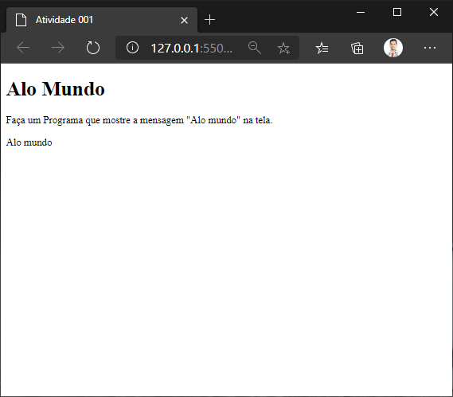
### 001.html

### 001.js

_____________

## Atividade 2
Faça um Programa que peça um número e então mostre a mensagem O número informado foi [número].

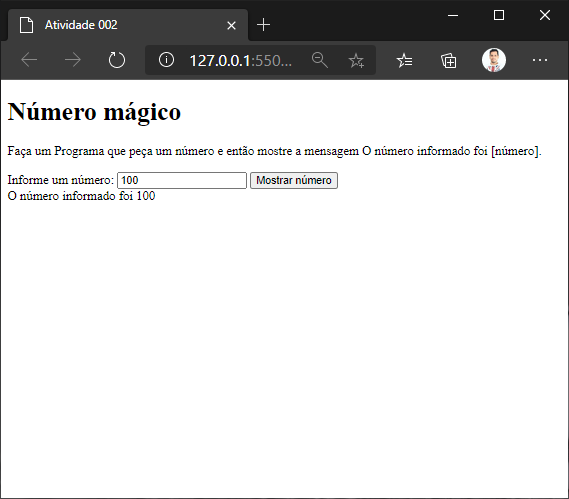
### 002.html
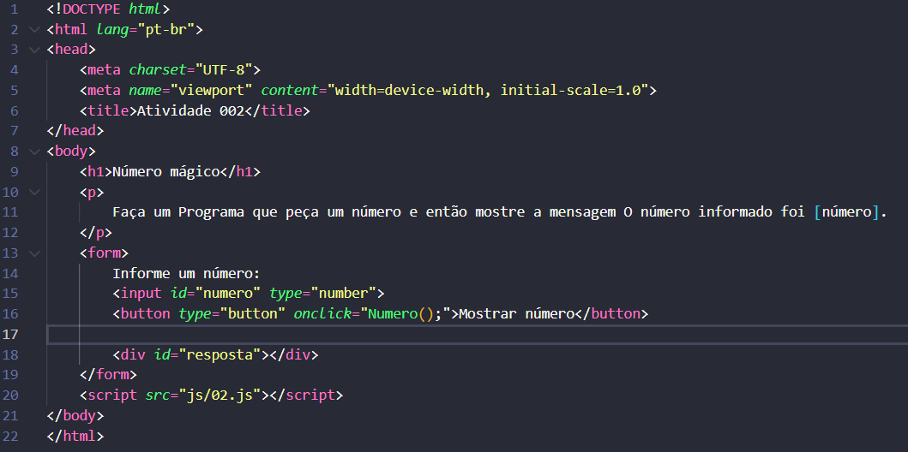
### 002.js

____________

## Atividade 3
Faça um Programa que peça dois números e imprima a soma.

### 003.html
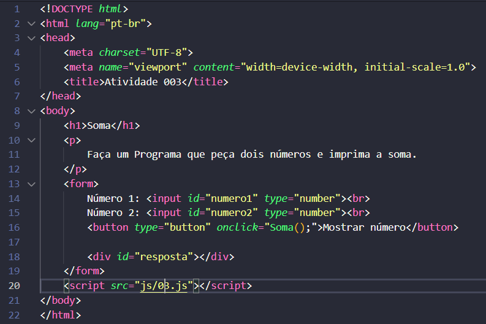
### 003.js

_____________

## Atividade 4
Faça um Programa que peça as 4 notas bimestrais e mostre a média.
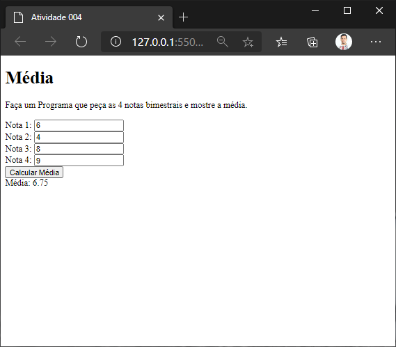
### 004.html

### 004.js

_____________

## Atividade 5
Tendo como dados de entrada a altura de uma pessoa, construa um algoritmo que calcule seu peso ideal, usando a seguinte fórmula: (72.7*altura) - 58
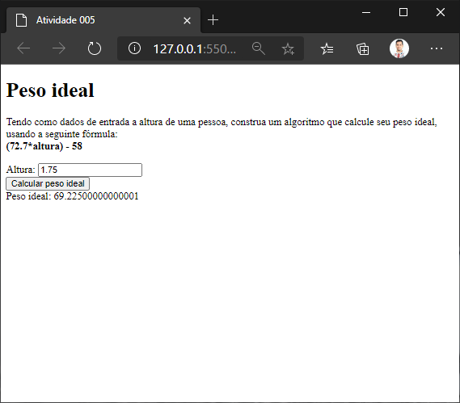
### 005.html
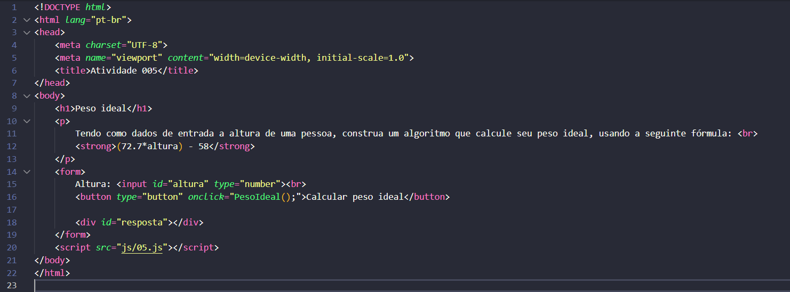
### 005.js

_____________

## Atividade 6
João Papo-de-Pescador, homem de bem, comprou um microcomputador para controlar o rendimento diário de seu trabalho. Toda vez que ele traz um peso de peixes maior que o estabelecido pelo regulamento de pesca do estado de São Paulo (50 quilos) deve pagar uma multa de R$ 4,00 por quilo excedente. João precisa que você faça um programa que leia a variável peso (peso de peixes) e calcule o excesso. Gravar na variável excesso a quantidade de quilos além do limite e na variável multa o valor da multa que João deverá pagar. Imprima os dados do programa com as mensagens adequadas.

### 006.html
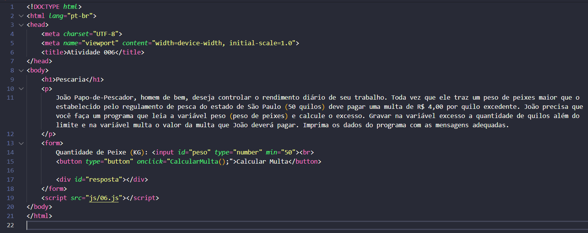
### 006.js

_____________

## Atividade 7
Faça um Programa que pergunte quanto você ganha por hora e o número de horas trabalhadas no mês. Calcule e mostre o total do seu salário no referido mês, sabendo-se que são descontados 11% para o Imposto de Renda, 8% para o INSS e 5% para o sindicato, faça um programa que nos dê:
- salário bruto.
- quanto pagou ao INSS.
- quanto pagou ao sindicato.
- o salário líquido.

calcule os descontos e o salário líquido, conforme a tabela abaixo:
- +Salário Bruto : R$
- -IR (11%) : R$
- -INSS (8%) : R$
- -Sindicato ( 5%) : R$
- =Salário Liquido : R$

Obs.: Salário Bruto - (IR + INSS + Sindicato) = Salário Líquido.

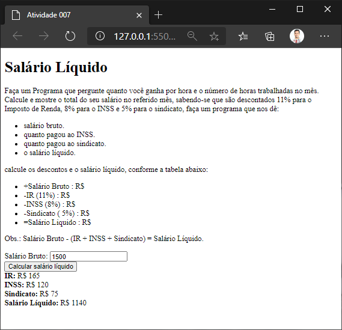
### 007.html
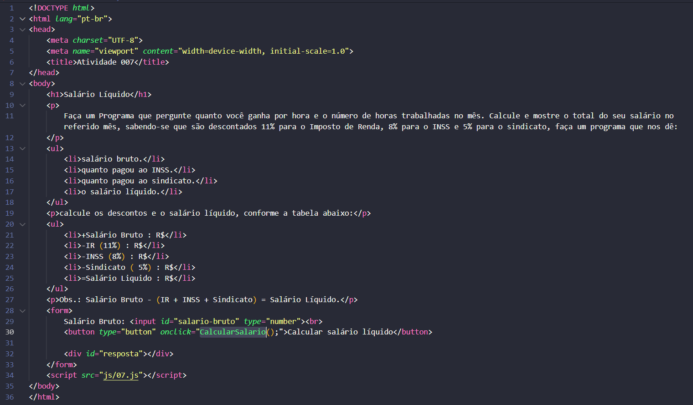
### 007.js

___________

## Atividade 8
Faça um Programa que peça dois números e imprima o maior deles.

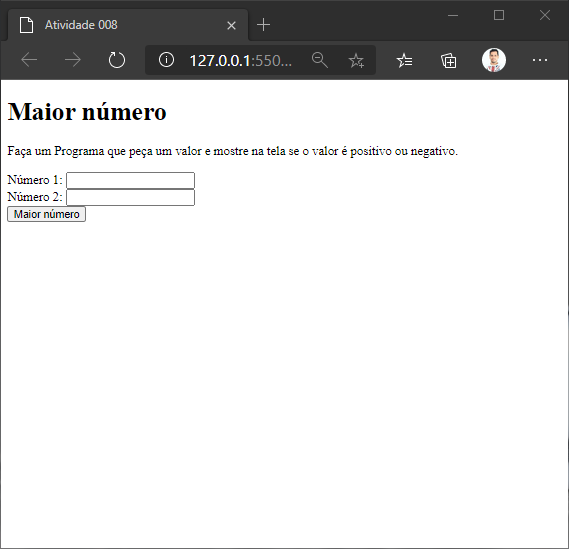

### 008.html

### 008.js
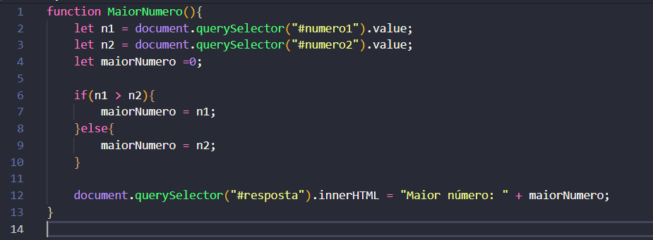

_____________

## Atividade 9
Faça um Programa que peça um valor e mostre na tela se o valor é positivo ou negativo.

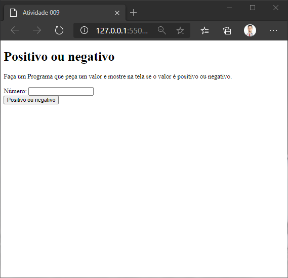

### 009.html

### 009.js
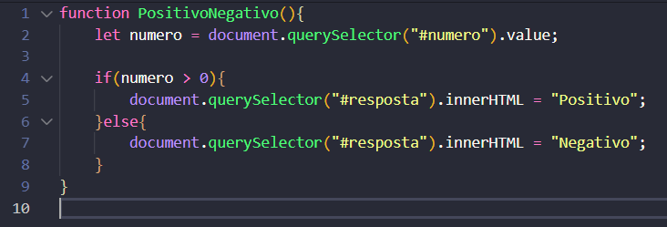

_____________

## Atividade 10
Faça um Programa que verifique se uma letra digitada é "G", "M", "P". Conforme a letra escrever: G - Grande, M - Média, P - Pequeno ou tamanho inválido caso alguém digite uma letra diferente dessas.

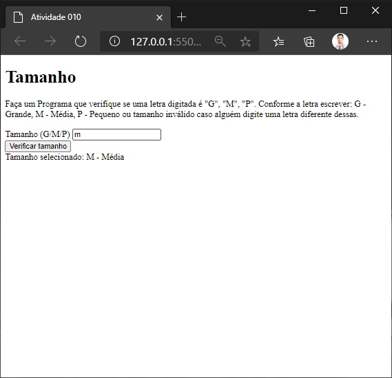
### 010.html

### 010.js
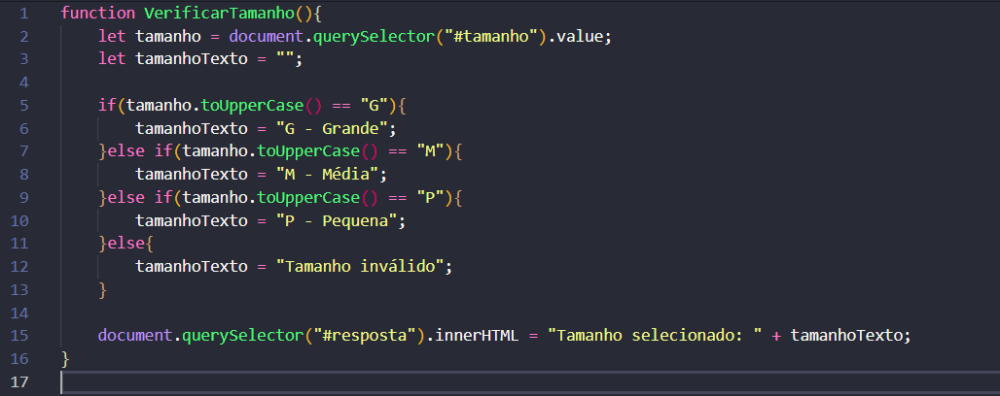

_____________

## Atividade 11
Faça um programa para a leitura de duas notas parciais de um aluno. O programa deve calcular a média alcançada por aluno e apresentar:
A mensagem "Aprovado", se a média alcançada for maior ou igual a sete;
A mensagem "Reprovado", se a média for menor do que sete;
A mensagem "Aprovado com Distinção", se a média for igual a dez.

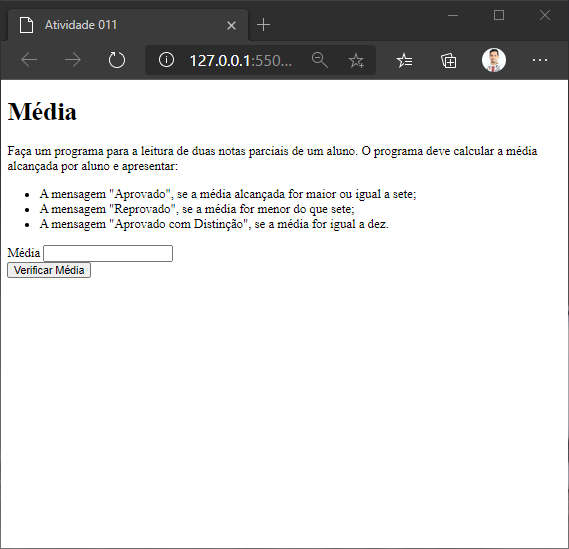
### 011.html
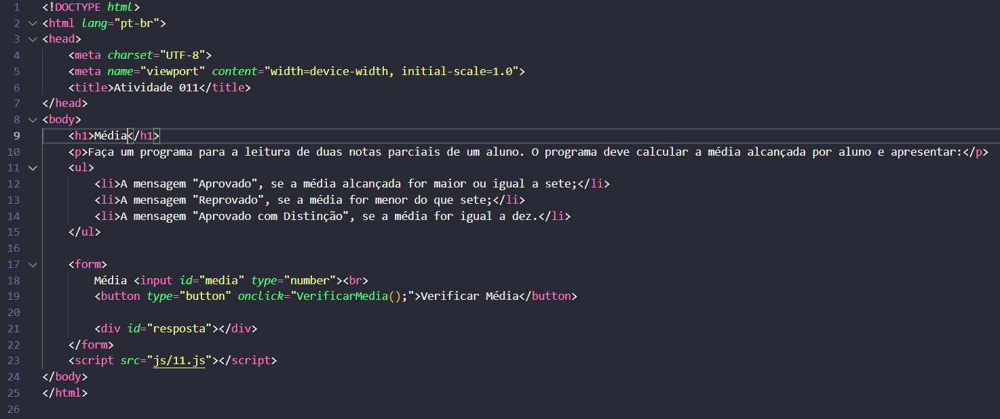
### 011.js
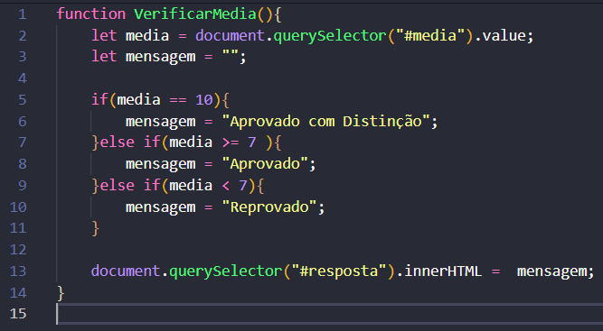

_____________

## Atividade 12
Faça um Programa que leia três números e mostre o maior deles.
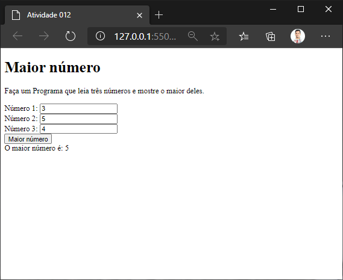

### 012.html

### 012.js
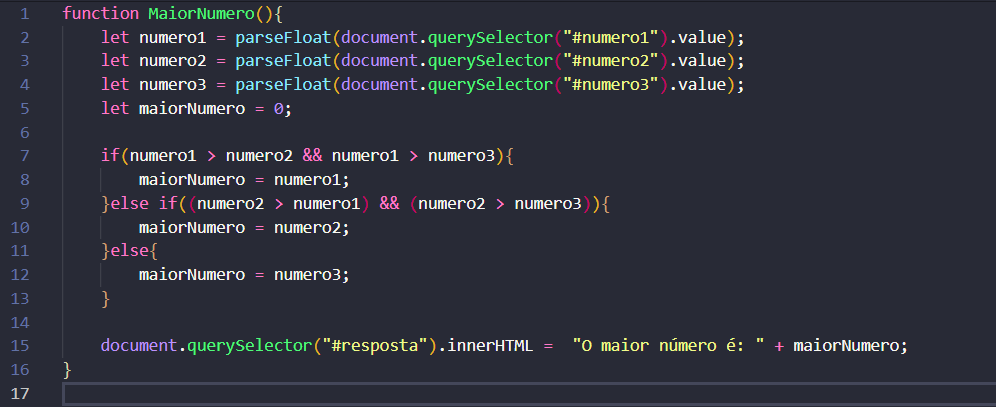
_____________

## Atividade 13
Faça um Programa que pergunte em que turno você estuda. Peça para digitar M-matutino ou V-Vespertino ou N-Noturno. Imprima a mensagem "Bom Dia!", "Boa Tarde!" ou "Boa Noite!" ou " - ", conforme o caso.

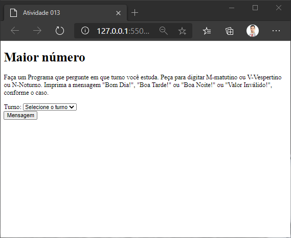

### 013.html
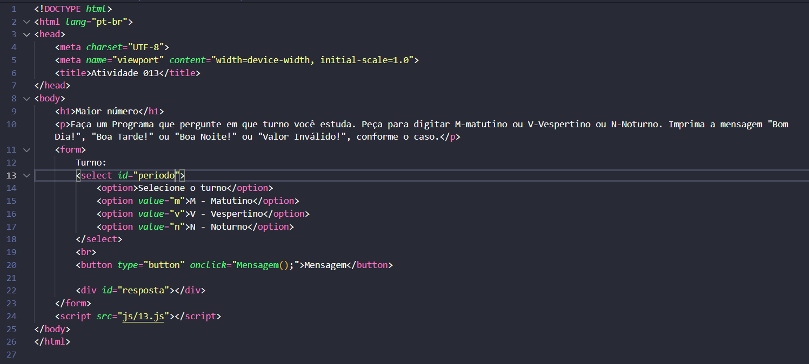

### 013.js
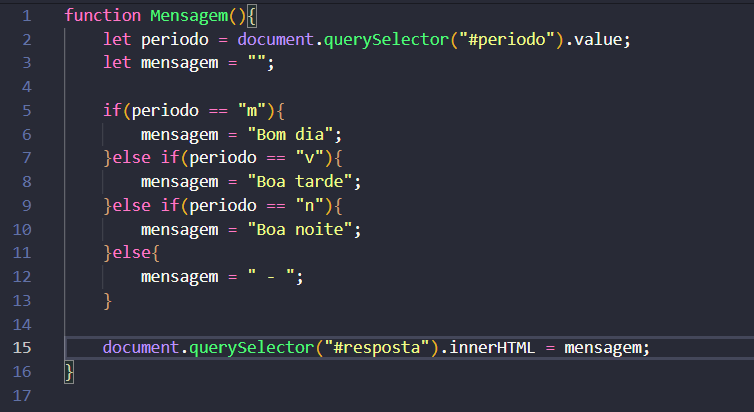

_____________

## Atividade 14
As Organizações Tabajara resolveram dar um aumento de salário aos seus colaboradores e lhe contrataram para desenvolver o programa que calculará os reajustes.
Faça um programa que recebe o salário de um colaborador e o reajuste segundo o seguinte critério, baseado no salário atual:
salários até R$ 280,00 (incluindo) : aumento de 20%
salários entre R$ 280,00 e R$ 700,00 : aumento de 15%
salários entre R$ 700,00 e R$ 1500,00 : aumento de 10%
salários de R$ 1500,00 em diante : aumento de 5% Após o aumento ser realizado, informe na tela:
o salário antes do reajuste;
o percentual de aumento aplicado;
o valor do aumento;
o novo salário, após o aumento.

_____________

## Atividade 15
Faça um programa que lê as duas notas parciais obtidas por um aluno numa disciplina ao longo de um semestre, e calcule a sua média. A atribuição de conceitos obedece à tabela abaixo:

  Média de Aproveitamento  Conceito
  Entre 9.0 e 10.0          A
  Entre 7.5 e 9.0           B
  Entre 6.0 e 7.5           C
  Entre 4.0 e 6.0           D
  Entre 4.0 e zero          
  
O algoritmo deve mostrar na tela as notas, a média, o conceito correspondente e a mensagem “APROVADO” se o conceito for A, B ou C ou “REPROVADO” se o conceito for D ou E.

_____________

## Atividade 16
Faça um Programa que leia um número e exiba o dia correspondente da semana. (1-Domingo, 2- Segunda, etc.), se digitar outro valor deve aparecer valor inválido.

_____________

## Atividade 17
Faça um Programa que peça um número inteiro e determine se ele é par ou impar. Dica: utilize o operador módulo (resto da divisão).

_____________

## Atividade 18
Faça um Programa que leia 2 números e em seguida pergunte ao usuário qual operação ele deseja realizar. O resultado da operação deve ser acompanhado de uma frase que diga se o número é:
par ou ímpar;
positivo ou negativo;

_____________

## Atividade 19
Faça um programa que imprima na tela os números de 1 a 20, um abaixo do outro. Depois modifique o programa para que ele mostre os números um ao lado do outro.

_____________

## Atividade 20
Faça um programa que imprima na tela apenas os números ímpares entre 1 e 50.

_____________

## Atividade 21
Faça um programa que receba dois números inteiros e gere os números inteiros que estão no intervalo compreendido por eles.

_____________

## Atividade 22
Altere o programa anterior para mostrar no final a soma dos números.

_____________

## Atividade 23
Desenvolva um gerador de tabuada, capaz de gerar a tabuada de qualquer número inteiro entre 1 a 10. O usuário deve informar de qual numero ele deseja ver a tabuada. A saída deve ser conforme o exemplo abaixo:
Tabuada de 5:
5 X 1 = 5
5 X 2 = 10
...
5 X 10 = 50

_____________

## Atividade 24
Faça um programa que calcule o número médio de alunos por turma. Para isto, peça a quantidade de turmas e a quantidade de alunos para cada turma. As turmas não podem ter mais de 40 alunos.

_____________

## Atividade 25
Faça um programa que calcule o valor total investido por um colecionador em sua coleção de CDs e o valor médio gasto em cada um deles. O usuário deverá informar a quantidade de CDs e o valor para em cada um.

_____________

## Atividade 26
O Sr. Manoel Joaquim possui uma grande loja de artigos de R$ 1,99, com cerca de 10 caixas. Para agilizar o cálculo de quanto cada cliente deve pagar ele desenvolveu um tabela que contém o número de itens que o cliente comprou e ao lado o valor da conta. Desta forma a atendente do caixa precisa apenas contar quantos itens o cliente está levando e olhar na tabela de preços. Você foi contratado para desenvolver o programa que monta esta tabela de preços, que conterá os preços de 1 até 50 produtos, conforme o exemplo abaixo:
Lojas Quase Dois - Tabela de preços
1 - R$ 1.99
2 - R$ 3.98
...
50 - R$ 99.50

_____________

## Atividade 27
O Sr. Manoel Joaquim acaba de adquirir uma panificadora e pretende implantar a metodologia da tabelinha, que já é um sucesso na sua loja de 1,99. Você foi contratado para desenvolver o programa que monta a tabela de preços de pães, de 1 até 50 pães, a partir do preço do pão informado pelo usuário, conforme o exemplo abaixo:
Preço do pão: R$ 0.18
Panificadora Pão de Ontem - Tabela de preços
1 - R$ 0.18
2 - R$ 0.36
...
50 - R$ 9.00

_____________

## Atividade 28
O Sr. Manoel Joaquim expandiu seus negócios para além dos negócios de 1,99 e agora possui uma loja de conveniências. Faça um programa que implemente uma caixa registradora rudimentar. O programa deverá receber um número desconhecido de valores referentes aos preços das mercadorias. Um valor zero deve ser informado pelo operador para indicar o final da compra. O programa deve então mostrar o total da compra e perguntar o valor em dinheiro que o cliente forneceu, para então calcular e mostrar o valor do troco. Após esta operação, o programa deverá voltar ao ponto inicial, para registrar a próxima compra. A saída deve ser conforme o exemplo abaixo:
Lojas Tabajara 
Produto 1: R$ 2.20
Produto 2: R$ 5.80
Produto 3: R$ 0
Total: R$ 9.00
Dinheiro: R$ 20.00
Troco: R$ 11.00
...

_____________

## Atividade 29
Desenvolva um programa que faça a tabuada de um número qualquer inteiro que será digitado pelo usuário, mas a tabuada não deve necessariamente iniciar em 1 e terminar em 10, o valor inicial e final devem ser informados também pelo usuário, conforme exemplo abaixo:
Montar a tabuada de: 5
Começar por: 4
Terminar em: 7

Vou montar a tabuada de 5 começando em 4 e terminando em 7:
5 X 4 = 20
5 X 5 = 25
5 X 6 = 30
5 X 7 = 35
Obs: Você deve verificar se o usuário não digitou o final menor que o inicial.

_____________

## Atividade 29
Desenvolva um programa que faça a tabuada de um número qualquer inteiro que será digitado pelo usuário, mas a tabuada não deve necessariamente iniciar em 1 e terminar em 10, o valor inicial e final devem ser informados também pelo usuário, conforme exemplo abaixo:
Montar a tabuada de: 5
Começar por: 4
Terminar em: 7

Vou montar a tabuada de 5 começando em 4 e terminando em 7:
5 X 4 = 20
5 X 5 = 25
5 X 6 = 30
5 X 7 = 35
Obs: Você deve verificar se o usuário não digitou o final menor que o inicial.
